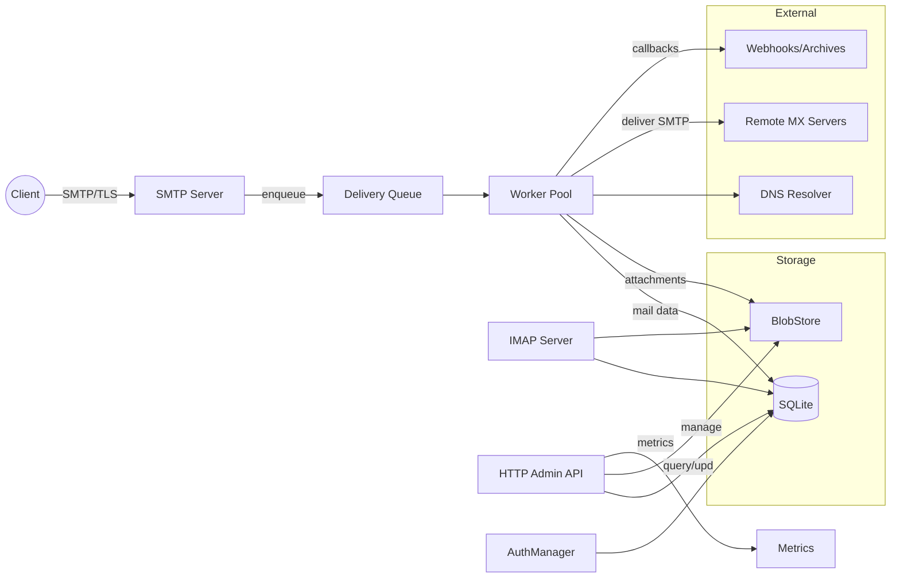

# Executive Summary

We propose a self‐contained, single‐binary Go mail server tailored for homelabs. It implements all standard email protocols (SMTP on ports 25/587/465, IMAP on 143/993, optional POP3, submission, SMTPS/IMAPS) plus an HTTP admin API. The design is heavily guided by the relevant RFCs: SMTP (RFC 5321/5322, plus extensions like submission RFC 2476 and AUTH RFC 2554), IMAP4rev1 (RFC 3501/9051), POP3 (RFC 1939), MIME (RFC 2045–2049), DKIM (RFC 6376), SPF (RFC 7208), and DMARC (RFC 7489/9989). Security features include TLS (RFC 8314, automatic ACME/Let’s Encrypt support) and modern auth (Argon2id, XOAUTH2). Storage is SQLite for metadata and a pluggable blobstore (filesystem, SQLite blob, or fbs-core S3‐compatible) for large payloads. Metrics and logs are exported via Prometheus and structured JSON. We provide detailed component diagrams, Go package layout, data schemas with indexes, and an API spec. 

**Key Features (example references)**: our design follows existing Go mail servers like *gomailserver* (all-in-one, Go, SMTP+IMAP+DKIM+SPF+DMARC+TLS) and *Mox* (Go, SMTP/IMAP/ACME/DMARC etc. for self-hosting). For instance, gomailserver advertises itself as an “all-in-one mail server… replacing complex stacks with a single daemon” and supports the standard ports and security features (25/587/465/143/993, DKIM, SPF, DMARC, TLS). We adopt similar port mappings and feature sets.

# Protocols and RFC Compliance

- **SMTP (RFC 5321/5322)**: We implement SMTP with ESMTP extensions. Support for *EHLO*, *STARTTLS*, *SIZE*, *PIPELINING*, *8BITMIME*, *SMTPUTF8*, etc. We also implement the message submission profile (ports 587/465, RFC 2476 for submission and RFC 8314 for implicit TLS) and SMTP-AUTH (RFC 4954/RFC 2554) with SASL PLAIN/LOGIN (and optional XOAUTH2). Anti-abuse includes size limits, per-client rate limits, optional greylisting/spam checks, and a strict “no open relay” policy (enforce authenticated users or known domains only).  
- **IMAP4rev1 (RFC 9051/RFC 3501)**: Full IMAP4rev1 support with common extensions: UIDs, FLAGS, IDLE, APPEND (upload), MOVE (if supported by storage), SEARCH, and mailbox hierarchy. We implement mailbox semantics (FOLDERS, INBOX, drafts/sent/trash, etc.) and persistent per-UID validity. All state (messages, flags, envelopes) stored in SQLite.  
- **POP3 (RFC 1939, optional)**: Basic POP3 service for clients, with optional support for STLS and APOP. Can be toggled off if not needed.  
- **DKIM (RFC 6376, 8463)**: Outgoing mail is signed per domain using DKIM. We support “relaxed” and “simple” canonicalization, RSA or Ed25519 keys (RFC 8463) with configurable selectors. Key rotation can be handled via scheduled re-key operations.  
- **SPF (RFC 7208)**: We perform SPF checks on incoming mail by querying DNS TXT records to verify sender IPs against allowed IPs in the sender’s SPF record.  
- **DMARC (RFC 7489/9989)**: We implement DMARC policy evaluation: require alignment of the RFC5322.From domain with SPF or DKIM domains, then apply the From-domain’s DMARC policy (reject/quarantine/report). Aggregate report generation (ARF) and optional forensic reporting can be added as needed.  
- **TLS (RFC 8314, 7672)**: Support STARTTLS on SMTP (port 587/25) and IMAP (143), and implicit TLS on SMTPS/IMAPS (465/993). We recommend TLS 1.3 and strong cipher suites. Servers use `crypto/tls.Config` with `MinVersion: tls.VersionTLS13` (fallback to 1.2 for legacy), `PreferServerCipherSuites`, and [H2]prefered curves. ACME integration (Let’s Encrypt) automatically provisions certs for the mail domain. MTA-STS (RFC 8461) and TLSRPT (RFC 8460) can be supported by fetching the domain’s policy and sending reports.  

Table: **Required Ports and Protocols** (typical homelab setup):  

| Port | Service       | Protocol         | Usage                                      |
|------|---------------|------------------|--------------------------------------------|
| 25   | SMTP Relay    | SMTP (ESMTP)     | MX Mail Transfer (with STARTTLS)           |
| 587  | SMTP Submit   | SMTP (with TLS)  | Mail Submission (client auth, STARTTLS)    |
| 465  | SMTPS (SSL)   | Implicit TLS SMTP| Submission over SSL/TLS (implicit)         |
| 143  | IMAP          | IMAP4 (RFC 9051) | Mail Access (with STARTTLS)                |
| 993  | IMAPS (SSL)   | Implicit TLS IMAP| Mail Access over SSL/TLS (implicit)        |
| 110  | POP3 (opt.)   | POP3             | Mail Access (with STLS) [optional]         |
| 443  | HTTPS/Admin   | HTTP (Admin API) | Admin API / Web UI (embedded web server)   |
| 80   | HTTP          | ACME            | ACME HTTP-01 challenge for cert renewal    |


# Architecture Overview

The mail server is a **monolithic Go process** that listens on all required ports. It uses Go’s lightweight concurrency: each incoming connection (SMTP, IMAP, POP3, HTTP) is handled in its own goroutine (a few KB stack each). A central `Server` struct orchestrates resources. Internally, major components communicate via an in-memory **event bus** or Go channels (e.g. SMTP→queue, IMAP mailbox updates). Critical shared services (user database, message store, queue) are safe for concurrent access (via transaction serialized by SQLite for writes, and read-committed transactions for reads). 

```go
type MailServer struct {
    Conf   Config
    Router *http.ServeMux  // admin API
    Storage *sql.DB        // SQLite connection for metadata
    Blob   BlobStore       // interface to blob/attachment store
    Queue  *QueueManager
    DKIM   *DKIMSigner
    SPF    *SPFVerifier
    DMARC  *DMARCPolicy
    Auth   *AuthManager
    // ... listeners, goroutine groups, etc.
}
```

We avoid heavyweight plugin frameworks. Instead, each functional area is a well-defined Go package with an interface: e.g. `BlobStore`, `SMTPHandler`, `IMAPHandler`, `QueueManager`, `AuthBackend`, etc. On startup, `main()` parses config (e.g. from TOML/YAML), initializes the database (SQLite in WAL mode), sets up the blob backend adapter, compiles TLS certs (self-signed or ACME), and starts network listeners. No dynamic loading; every dependency is compiled in (static binary).  

### Component Interaction (Flowchart)



This diagram shows key interactions: SMTP ingress puts messages onto a queue, workers pull from the queue and store emails in the SQLite DB and BlobStore, then deliver via SMTP to remotes. IMAP/POP3 read directly from the same storage. The admin API reads/writes metadata (users, aliases, domains) and can manage queued messages or reload config. All use the shared `MessageDB` and `BlobStore` components.

# Go Package Layout & Interfaces

We organize the code into clear Go packages. Each package exposes a minimal public API; implementation details are internal. Example structure:

```
/cmd/mailserver      // main, starts the server
/pkg/
  api/               // Admin HTTP handlers (Go net/http)
  smtp/              // SMTP server (handlers for commands, relay logic)
  imap/              // IMAP server
  pop3/              // POP3 server (optional)
  queue/             // Queueing/delivery logic, worker pool
  storage/           // Metadata store (SQLite schema, queries)
  blobstore/         // BlobStore interface & adapters (fs, sqlite, fbs)
  auth/              // Authentication (Argon2, session tokens, OAuth2)
  dkim/              // DKIM signing (canonicalization, key mgmt)
  spf/               // SPF record checking
  dmarc/             // DMARC policy evaluation
  tls/               // TLS configuration helpers (cert mgmt, config)
  dns/               // DNS lookups (MX, SPF, DMARC TXT)
  mime/              // MIME parsing/utility (using stdlib mime/multipart)
  metrics/           // Prometheus metrics counters/gauges
  util/              // misc (logging, config parsing)
```

**SMTP Package (`smtp`)**: exports interfaces like `type SMTPServer struct{...}`, methods `Serve(l net.Listener)`; handles commands (EHLO/MAIL/RCPT/DATA/AUTH). Public interface handles one connection. 

**IMAP Package (`imap`)**: provides an `IMAPServer` that implements RFC 3501 tag-based protocol. It calls into the storage backend to list mailboxes, fetch/append messages, manage flags. 

**Queue Package (`queue`)**: a central `QueueManager` manages deferred deliveries. It provides methods `Enqueue(envelope)`, and runs a worker pool (N configurable goroutines) that pick up due items, perform delivery attempts, and implement retry/backoff. It schedules based on a next-attempt time and maintains an SQL table. 

**Storage Package (`storage`)**: encapsulates SQLite database access. Defines types like `User`, `Message`, `Mailbox`, etc., and methods to create/update/query them. Example public API: 
```go
type Storage interface {
    CreateUser(ctx, User) (UserID, error)
    AuthenticateUser(ctx, username, password) (UserID, error)
    GetMailbox(ctx, userID, name) (Mailbox, error)
    ListMessages(ctx, mailboxID, limit, sinceUID) ([]Message, error)
    SaveMessage(ctx, Message) (MessageID, error)
    UpdateFlags(ctx, messageID, flags) error
    // ...
}
```
Under the hood, this runs SQL queries on SQLite.

**Blobstore Package (`blobstore`)**: defines 
```go
type Capabilities struct {
    Streaming bool  // can stream without loading all into memory
    RangeRead bool  // supports ranged reads (HTTP range)
    Checksums bool  // can validate checksums (MD5/SHA) on upload
}
type Store interface {
    Put(ctx, r io.Reader, metadata map[string]string) (string, error) // returns a key
    Get(ctx, key string) (io.ReadCloser, error)
    Delete(ctx, key string) error
    Exists(ctx, key string) (bool, error)
    Capabilities() Capabilities
}
```
We ship three adapters: `sqliteBlob` (stores blobs as BLOB in SQLite), `fsBlob` (stores files on disk under a root path), and `fbsBlob` (S3-compatible FBS backend). Each adapter reports its Capabilities bitmask. For example, the filesystem may not support RangeRead easily, while FBS does (via signed URL). Using interfaces lets the server code treat attachments uniformly regardless of backend.

**Auth Package (`auth`)**: supports user credential checking and session tokens. It uses Argon2id hashing (per [RFC 9106]) to store passwords. Example interface: 
```go
type AuthStore interface {
    VerifyPassword(ctx, userID, password string) (bool, error)
    CreateSession(ctx, userID, expiry) (token string, error)
    GetUserBySession(ctx, token) (UserID, error)
}
```
We support `LOGIN/PLAIN` SASL for IMAP and SMTP, and optional XOAUTH2 bearer tokens. All auth events (success/fail logins) are audit-logged.

**Other packages** (DKIM, SPF, DMARC, TLS, DNS, mime, metrics) each encapsulate a focused task. For example, `dkim` provides a function to sign a raw message given a private key; `metrics` registers Prometheus counters (emails received, sent, spam blocked, etc).

# Data Models and SQLite Schema

We use **SQLite** (3.x) for metadata (mail, users, queue, etc.). It runs in WAL mode for concurrency. We define tables roughly as follows (shown in DDL form with primary keys and some indexes):

- **users**: mail account credentials  
  ```
  CREATE TABLE users (
      id INTEGER PRIMARY KEY,
      email TEXT UNIQUE NOT NULL,         -- user’s email address (local@domain)
      password_hash TEXT NOT NULL,        -- Argon2id hash
      created_at INTEGER NOT NULL,        -- timestamp
      is_active BOOLEAN NOT NULL DEFAULT 1
  );
  ```
  *Indexes*: UNIQUE(email).

- **domains**: accepted recipient domains  
  ```
  CREATE TABLE domains (
      name TEXT PRIMARY KEY,
      is_active BOOLEAN NOT NULL DEFAULT 1
  );
  ```
  (Alternatively integrated in users/aliases via domain part, but explicit table can simplify policy.)

- **aliases**: address forwarding  
  ```
  CREATE TABLE aliases (
      id INTEGER PRIMARY KEY,
      source TEXT NOT NULL,  -- alias email (left-hand side)
      destination TEXT NOT NULL, -- actual target (could be user email or other)
      domain TEXT NOT NULL,
      UNIQUE(source, domain)
  );
  ```
  *Indexes*: on (source, domain).

- **mailboxes**: user mailboxes (INBOX, Sent, custom folders)  
  ```
  CREATE TABLE mailboxes (
      id INTEGER PRIMARY KEY,
      user_id INTEGER NOT NULL,
      name TEXT NOT NULL,
      UNIQUE(user_id, name)
  );
  ```
  E.g. each user has mailbox “INBOX”, “Sent”, etc.

- **messages**: headers/metadata of each email  
  ```
  CREATE TABLE messages (
      id INTEGER PRIMARY KEY,
      mailbox_id INTEGER NOT NULL,
      uid INTEGER NOT NULL,           -- IMAP-UID for the mailbox
      blob_key TEXT NOT NULL,         -- key in BlobStore for full RFC822 content
      size INTEGER NOT NULL,
      flags INTEGER NOT NULL DEFAULT 0,  -- bitmask for \Seen, \Flagged, etc.
      internal_date INTEGER NOT NULL, -- Unix time email was received
      from_addr TEXT, 
      to_addr TEXT,
      subject TEXT,
      -- Other indexed fields (date, etc.) as needed
      UNIQUE(mailbox_id, uid)
  );
  ```
  *Indexes*: primary key id, index on mailbox_id (for listing), on (mailbox_id, uid). 

- **attachments**: metadata for message attachments (for dedup)  
  ```
  CREATE TABLE attachments (
      id INTEGER PRIMARY KEY,
      message_id INTEGER NOT NULL,
      blob_key TEXT NOT NULL,    -- key in BlobStore
      filename TEXT,
      mime_type TEXT,
      size INTEGER,
      sha256 TEXT,  -- hash for dedup
      refcount INTEGER NOT NULL DEFAULT 1
  );
  ```
  *Indexes*: on sha256 (for dedup lookup).

- **queue**: deferred deliveries and retry data  
  ```
  CREATE TABLE queue (
      id INTEGER PRIMARY KEY,
      message_id INTEGER NOT NULL,
      rcpt_to TEXT NOT NULL,     -- each row one recipient
      next_attempt INTEGER NOT NULL,
      attempt_count INTEGER NOT NULL DEFAULT 0,
      status TEXT NOT NULL DEFAULT 'pending'
  );
  ```
  *Indexes*: next_attempt (for scheduling), status. This table drives the delivery worker pool.

- **sessions**: admin/user web sessions  
  ```
  CREATE TABLE sessions (
      token TEXT PRIMARY KEY,
      user_id INTEGER NOT NULL,
      expires_at INTEGER NOT NULL
  );
  ```

- **audit_logs**: significant actions (login, config reload, send, delete)  
  ```
  CREATE TABLE audit_logs (
      id INTEGER PRIMARY KEY,
      timestamp INTEGER NOT NULL,
      user_id INTEGER,
      event TEXT NOT NULL,
      details TEXT
  );
  ```

Above schemas balance simplicity with functionality. SQLite’s dynamic typing means we simply use `INTEGER`, `TEXT`, `BLOB` as needed (booleans are 0/1). We enable WAL journaling for concurrency. On startup or migration, we can run `CREATE TABLE`/`ALTER TABLE` queries (using a `PRAGMA user_version` to track migrations). Hot-reload on SIGHUP can signal workers to refresh in-memory configs and domain lists (but schema changes require downtime).

**Capability: Deduplication.** When storing attachments, we compute SHA256. If a blob already exists (same hash), we reuse it and increment `refcount`. We remove the actual blob only when `refcount` drops to 0. This avoids storing duplicate large files (common for forwarded attachments). The `attachments` table’s `blob_key` field and `sha256` index support this. 

# BlobStore Interface and Backends

The `blobstore` package defines the `Store` interface shown earlier. Example implementation details:

- **SQLite Blob Adapter**: uses a table like `CREATE TABLE blobs (key TEXT PRIMARY KEY, data BLOB);`. Simpler for small installations (everything in one DB file), but large BLOBs cause DB size to blow up. (SQLite has a 2GB limit per blob by default.) Capabilities: Streaming=false (must load into memory), RangeRead=false, Checksums=false. 

- **Filesystem Adapter**: stores blobs as files under a root directory. Keys map to safe paths (e.g. by hex-sharding or date-based). Uses OS `sendfile` for efficient streaming. Pros: simple, no external dependency, still fits single-node. Capabilities: Streaming=true, RangeRead=true (serve via HTTP partial content), Checksums=false.

- **FBS (i-got-this-faa/fbs-core)**: an S3-like Go service with SQLite metadata. We talk to it over HTTP with AWS SigV4 auth. FBS supports atomic writes, multipart uploads, checksums, etc. We would implement an adapter that sends HTTP requests to FBS endpoints. Capabilities: Streaming=true, RangeRead=true (S3 supports ranged GET), Checksums=true (it validates MD5). We’d require minimal fbs configuration (e.g. URL, access keys). 

Each adapter’s `Capabilities()` allows the mail server to optimize operations (e.g. skip range reads if not supported, or skip multipart uploads). In our config, the admin selects the backend:

```toml
[storage]
backend = "filesystem"  # or "sqlite", or "fbs"
path = "/var/mail/blobs"
# For FBS:
fbs_endpoint = "https://fbs.local:9000"
fbs_bucket = "mail"
```

This approach means a Pi user can just use SQLite-only, while advanced users plug in their FBS or other S3 systems. In practice, only attachments and full raw messages go to blobs; headers and indices stay in SQLite. 

# Queue Semantics and Delivery

Incoming mail (after SMTP `DATA` completion) is inserted into the `messages` table and one row per recipient into `queue`. The **Queue Manager** maintains a priority queue (min-heap) in memory of next delivery times (backed by the SQL `queue.next_attempt` index). A pool of N workers (configurable) continuously pop due deliveries. Each worker:

1. Fetches the `queue` row, marks it “in-progress” (update status).
2. Retrieves the message blob(s) and reconstructs the envelope.
3. Performs DNS MX lookup (with caching). 
4. Attempts SMTP submission to the remote MX (on port 25, using STARTTLS if advertised, using local domain certs for outgoing TLS). 
5. On success, marks that queue row delivered (delete from `queue`, log success). 
6. On transient failure (timeout, 4xx code), increments `attempt_count`, sets `next_attempt = now + backoff`. For backoff we use exponential (e.g. 1m, 5m, 15m, 1h, etc). We cap retries or move to a “dead” queue if permanently undeliverable after e.g. 5 attempts. 
7. On permanent failure (5xx), log and optionally bounce/NDR to sender.

Concurrency: many queue entries may deliver in parallel. SQLite ensures only one writer at a time (due to WAL, only one writer lock). We keep transactions short: delete or update one queue row per tx. Other pending items wait briefly, which is acceptable at homelab scale. 

Retries are scheduled via a simple in-process scheduler. We could also use SQLite triggers or signals, but an in-memory `time.AfterFunc` or dedicated ticker is easier. For example, we might run `SELECT id FROM queue WHERE next_attempt <= NOW()` every few seconds to enqueue jobs.

# IMAP Features and Mailbox Semantics

Our IMAP implementation (RFC 9051) provides full mailbox semantics. Key features:

- **UIDs**: Each message has a unique UID in its mailbox (monotonic). We store it in `messages.uid`. On APPEND, we assign next UID (max+1) atomically in the same transaction that inserts the row. 
- **FLAGS**: Persistent \Seen,\Answered,\Flagged,\Deleted,\Draft,\Recent flags (RFC 3501). We encode flags as a bitmask in `messages.flags`. The IMAP server exports FETCH (FLAGS) and STORE (to change flags).  
- **IDLE**: We support the IDLE command so IMAP clients can wait for new mail notifications. Internally, new mail insertion triggers a broadcast to any waiting client goroutines (via channels).  
- **APPEND**: Clients can upload new messages to a mailbox. This writes to `messages` and adds a blob (or reuses one if dedup).  
- **MOVE**: Optional, to move messages between mailboxes (implemented as an atomic update of `mailbox_id`). We set up an “archive” mailbox for inbound spams or DULB, etc.  
- **SEARCH**: Basic search (by header, date, flag) is done via SQL queries (e.g. `WHERE mailbox_id=? AND flags & ? ...`). For larger installations, one could integrate FTS5 for full-text indexing of headers/body. By default we support simple searches (FROM, SUBJECT keywords, date ranges, flag presence). 
- **Namespaces**: We use standard INBOX hierarchy; no special prefix. The admin API can create new mailboxes per user.  

Mailbox hierarchy (folder names) is managed via the `mailboxes` table (each user may have multiple named mailboxes). On user creation, we create default mailboxes (INBOX, Sent, Trash, Spam). The IMAP server enforces quotas (configurable storage/message count limits per mailbox or account) and respects deleted flags (expunge can be manual or automatic).

# SMTP Behavior and Policies

The SMTP server handles both incoming and outgoing (for submission) scenarios:

- **EHLO/HELO**: We announce our hostname and extensions: SIZE (max message size, configurable), 8BITMIME, STARTTLS, AUTH mechanisms, PIPELINING, etc. 
- **STARTTLS**: Mandatory for  submission port unless we use implicit TLS on 465. We disable plain text unless STARTTLS was negotiated. 
- **AUTH**: Implements SASL PLAIN and LOGIN (via encrypted connection) for submission. Username = full email address or alias. We verify against `users` table (Argon2id hash check). On AUTH success, we log the user’s identity for the session, enabling mail submission and bypassing relay limits. 
- **Anti-relay**: By default we reject any attempt to relay unauthenticated mail for outside domains. Only authenticated users or mail to domains in our `domains` list are accepted. 
- **Rate limiting and greylisting**: To prevent abuse, we can enforce per-IP rate limits (e.g. no more than N messages per minute), implemented via an in-memory token bucket or Redis (if we allowed it). Greylisting (temporarily rejecting unknown senders) can be implemented by storing a tuple (IP,sender,recipient) and delaying acceptance on first attempt. We can queue rejected attempts for local inspection.  
- **Size limits**: We enforce a max message size (e.g. 50MB by default). The SMTP server advertises `SIZE=52428800`. If a client exceeds that, we return 552.
- **Logging**: Each SMTP transaction (from envelope to final action) is logged in JSON: timestamp, remote IP, HELO, MAIL FROM, RCPT TO, result (accepted/delivered/bounced).  

# DKIM Signing Flow

Outgoing mail passes through the DKIM signer before queueing. The flow:

1. **Select Domain/Key**: Based on sender’s domain (the `From:` header domain or envelope sender), retrieve the DKIM private key and selector from config. Keys rotate by using different selector tags in DNS (e.g. `2026._domainkey.example.com`).  
2. **Canonicalization**: We apply “relaxed” canonicalization by default (headers unwrapping, case-normalization, whitespace folding) or “simple” if configured. The DKIM package prepares a hash of selected headers and the body (with RFC 6376 rules).  
3. **Sign**: Using crypto (RSA-SHA256 or Ed25519), create the DKIM-Signature header value. We attach it to the message headers. This is done just before converting to RFC822 format.  
4. **Key management**: Private keys are stored in configuration (encrypted or file). The admin API can rotate them: e.g. generate a new key with selector “dkim2”, publish DNS TXT for `dkim2._domainkey`, and update config so new mails use it. Old mails remain valid with old selector until keys are changed.  
5. **Verification**: On incoming mail, the receiver would do DKIM verify, but since this is a MTA/MDA, we only sign outgoing. (We could optionally verify incoming DKIM, but that’s part of spam check.)

We should cite: DKIM is standardized by RFC 6376. For signing details (relaxed/simple canonicalization), see RFC 6376, and for Ed25519 see RFC 8463 (Wikipedia note, or actual RFC 8463 for DKIM ED25519). In practice we rely on a Go DKIM library (e.g. github.com/toorop/go-dkim) that implements this standard.

# SPF and DMARC Policy Evaluation

When a mail is received, we perform authentication checks:

- **SPF**: Query the sender domain’s SPF record (DNS TXT) and check if the client IP is authorized. Use a Go SPF library or implement SPF logic (expand include, a, mx, ptr, ip4/6, exists). The result is Pass/Fail/SoftFail/Neutral. We record it for DMARC.  
- **DKIM**: If a DKIM-Signature is present, we verify it (optional). A pass gives DKIM Authenticated status.  
- **DMARC**: We then check alignment: if *either* the SPF-passed domain or a DKIM-passed domain “aligns” with the RFC5322.From domain (either identical or subdomain, depending on relaxed/alignment rules). If aligned, DMARC passes; if not, DMARC fails. Based on the domain’s DMARC DNS policy (p=none/quarantine/reject), we may reject or drop the message. For a homelab, we usually have “p=none” (reporting only) by default.

DMARC also allows generating aggregate reports; we can optionally implement an async report generator that emails `rua` addresses with XML reports. Out of scope for MVP but part of compliance. 

# TLS and Certificate Management

We support three TLS modes:

1. **Self-Signed Certs**: On first run, generate a self-signed cert for the given hostname, stored on disk. Use it for TLS on all services. Allows immediate encryption but is untrusted by clients.
2. **Provided Certs**: If the user has valid certificates (in PEM files), we load them at startup. The config can point to `tls_cert` and `tls_key` for SMTP/IMAP; the HTTP admin can reuse those or have its own. 
3. **ACME (Recommended)**: Integrate with `golang.org/x/crypto/acme/autocert`. On startup, if ACME is enabled and we have a reachable domain, we perform HTTP-01 or TLS-ALPN challenge (the built-in web server on 443 handles it). This obtains a valid cert chain for the domain. We automatically renew before expiry.  
   
In Go’s `tls.Config`, we set `MinVersion: tls.VersionTLS13` and cipher suites per modern recommendations (we may copy [Mozilla’s or Golang stdlib defaults]). We enable session tickets, OCSP stapling if possible, etc. We disable SSLv3/2, TLS1.0/1.1. Forward secrecy (ECDHE) and strong curves (X25519, P-256) are used.

# Authentication Backend

Passwords use **Argon2id hashing** (RFC 9106) with appropriate time/memory parameters (e.g. 1 iteration, 64MB RAM). Argon2id is recommended as default in RFC 9106. On user creation or password change, we hash the plaintext and store. No plaintext or weaker hashes. 

Sessions (for the web/API) use opaque tokens (e.g. JWT or random UUID stored in `sessions` table). We implement an `/api/login` endpoint that checks credentials and returns a session token with expiry. The HTTP API uses Bearer tokens or cookie-based sessions (secure, HttpOnly). For SMTP/IMAP AUTH, we only use basic (PLAIN) or XOAUTH2 tokens that map to our user accounts. Failed login attempts are logged (can trigger account lockout after many failures).

# Logging, Metrics, and Observability

We use structured logging (JSON) for all components, so logs can be parsed by log aggregators. Each log entry includes a timestamp, module (e.g. “SMTP”, “IMAP”, “Queue”), a correlation ID (session or message ID), and details. Example: 

```json
{"time":"2026-07-05T22:00:00Z","module":"SMTP","client":"192.0.2.1","command":"EHLO","status":"OK"}
```

Errors include stack traces in debug mode.

For metrics, we expose a Prometheus endpoint (e.g. `/metrics` on HTTP API port). We track counters like `smtp_connections`, `smtp_received_total`, `smtp_rejected_total`, `imap_sessions`, `queue_pending`, `queue_failed`, `messages_stored_total`, etc. These help monitor the server’s health. The Mox server, for example, includes Prometheus metrics for operational insight.

# Admin HTTP API and Web UI

We embed an HTTP server (using Go’s `net/http`) for administration. Endpoints include:  

| Method | Path               | Description                                |
|--------|--------------------|--------------------------------------------|
| GET    | `/api/health`      | Liveness/healthcheck (200 OK)              |
| GET    | `/api/metrics`     | Prometheus metrics                         |
| GET    | `/api/users`       | List users/accounts                       |
| POST   | `/api/users`       | Create a new user                         |
| PUT    | `/api/users/{id}`  | Update user (password, active, etc.)      |
| DELETE | `/api/users/{id}`  | Delete user                              |
| GET    | `/api/domains`     | List accepted domains                     |
| POST   | `/api/domains`     | Add domain (includes DNS record instructions) |
| GET    | `/api/aliases`     | List email aliases                        |
| POST   | `/api/aliases`     | Create alias (source→target)              |
| GET    | `/api/queue`       | View pending mail queue entries           |
| DELETE | `/api/queue/{id}`  | Remove or bounce a queued message         |
| POST   | `/api/dkim/rotate` | Trigger DKIM key rotation (generate new)  |
| GET    | `/api/stats`       | Mail server stats (delivered, spam, etc.) |

The web UI (if enabled) is a single-page app (e.g. using embedded React/Vue static files via `//go:embed`). It calls these APIs to provide forms for setup. Similar to gomailserver or Mox’s web UI. The UI serves on the same HTTP port (443) or separate port (e.g. 9980); config option. We do *not* require a separate container for the UI; it’s bundled in the binary.

# Deployment and Build

We provide a **Dockerfile** and **release notes** for building. Key points:

- The Go binary is compiled static (`CGO_ENABLED=0`) to simplify Alpine use. We target a modern Go version (>=1.18).  
- We use `FROM golang:alpine AS builder` with `apk add --no-cache build-base git` then `go build -ldflags '-s -w'`. Resulting binary is ~3-5 MB (plus static libs, under 10MB).  
- Final image: `FROM alpine:latest` (or scratch) with ca-certificates. Copy the binary and default config (`.toml`), SQLite DB init SQL, etc.  
- Ports exposed: 25/tcp, 587, 465, 143, 993, and 443 (for HTTP) if using ACME/HTTP-01.  
- Entrypoint runs `mailserver --config /etc/mailserver/config.toml`.  
- We document that users should mount a volume for `/var/lib/mailserver` (storage) and `/etc/mailserver` (config).  

In CI/CD, we use GitHub Actions to run `go test ./...`, static analysis (Vet, GolangCI-Lint), then build multi-arch containers, and publish Docker image (and static binaries). 

# Backup/Restore and Migrations

- **Backup**: Since metadata is SQLite, a simple file copy (or `sqlite3 .dump`) is enough. We should ensure a brief lock (e.g. use `BEGIN IMMEDIATE` to flush WAL). Alternatively, stop the service and copy DB and blob storage. Provide a `--backup` command that outputs a .tar.gz of SQL dumps and blob files.  
- **Restore**: A `--restore` command can import SQL and blobs. Or simply replace the DB file and blob directory, then restart.  
- **Migrations**: We track `PRAGMA user_version`. On startup, if the database version is behind, we run migrations (alter table, create columns, etc.) as coded in an ordered list. The admin API could include a `/api/reload` or `/api/migrate` endpoint (protected by auth) to trigger a manual migration.  
- **Hot-reload**: We support reloading configuration (new domains, storage backend, etc.) on SIGHUP. The server listens for SIGHUP and then re-reads the config file and replaces in-memory structures (e.g. reload domain list into memory, instruct SMTP to recognize new domains, etc.) without dropping existing connections. 

- **Security Audit**: Provide a `mailserver audit` subcommand that checks configuration and environment: e.g. warns if running as root (should drop to unprivileged user), if certs are near expiry, if DNS records (SPF/DKIM/DMARC) are properly set (by doing DNS queries and comparing with config). It prints a report and exit status for CI integration.

# Testing Strategy and CI

We implement thorough tests:

- **Unit tests** for each package: storage queries (use an in-memory SQLite), SMTP command handling (mock connections using `net/textproto`), IMAP parser, DKIM signing/verifying, SPF/DMARC logic (using test DNS zone data).  
- **Integration tests**: We can bring up the server and connect via SMTP/IMAP clients (using Go std `net/smtp` or an IMAP library), sending and retrieving mails end-to-end. The `maddy` project did something similar for Go. We also test TLS handshake (with a test CA), and ensure protocols negotiate correctly (AUTH, STARTTLS, IDLE).  
- **Fuzzing**: For robustness, fuzz input parsing: e.g. fuzz SMTP command parser, MIME parser (malformed headers), and decoding large mails to ensure no panics. Use Go’s fuzz support (`go test -fuzz=...`).  
- **Load tests**: Simulate hundreds of SMTP transactions to measure performance. Likely not needed for homelab.  
- **CI/CD**: On each PR, run `go test`, lint (golangci-lint), and a lightweight Docker build. We also use `go mod verify` for dependency integrity.

# Minimal Roadmap & Effort

We break the project into milestones:

| Milestone                  | Description                                          | Est. Effort |
|----------------------------|------------------------------------------------------|-------------|
| **1. Core Architecture**    | Project skeleton: config parsing, main server struct, routing, empty handlers for SMTP/IMAP/HTTP. | 1–2 weeks |
| **2. Storage Layer**       | Design SQLite schema, implement `storage` package, user/admin CRUD, and unit tests.  | 1 week |
| **3. BlobStore & Attach.** | Define BlobStore interface, implement filesystem and SQLite blob adapters, and message store integration (attachments). | 1 week |
| **4. SMTP Server**        | Implement basic SMTP command flow, message ingestion into DB/queue, AUTH, STARTTLS.  | 2–3 weeks |
| **5. Queue & Delivery**    | Build queue system, delivery workers, retry logic, DNS lookup, and test sending to real MTAs. | 2 weeks |
| **6. IMAP Server**        | Implement IMAP (using existing Go libraries or from spec), mailbox and message retrieval. Include IDLE. | 2–3 weeks |
| **7. Authentication**       | Integrate Argon2id auth, login sessions, enforce relay/auth rules. | 1 week |
| **8. DKIM/SPF/DMARC**      | Add DKIM signing on outgoing, SPF/DMARC checks on incoming.   | 1–2 weeks |
| **9. TLS/ACME**           | Set up TLS config, self-signed and ACME integration for SMTP/IMAP/HTTP. | 1 week |
| **10. Admin API/UI**       | Develop HTTP API endpoints and embed a simple web UI (or serve static files). | 2 weeks |
| **11. Logging/Metrics**    | Add structured logging, Prometheus instrumentation.    | 1 week |
| **12. Testing & Docs**    | Write comprehensive tests, CI scripts, user documentation. | 2 weeks |

_Total_: ~3–4 months (assuming a small team or one experienced Go dev). Each milestone overlaps testing and documentation.

# Component Interaction Timeline

```mermaid
gantt
    title Mail Delivery Flow
    dateFormat  HH:mm:ss
    axisFormat  %H:%M:%S
    section Inbound Mail
    SMTP Transfer: done,     d1, 00:00:00, 00:00:01
    Store to Queue:          d2, after d1, 00:00:01
    section Delivery Prep
    DNS Lookup MX:          d3, after d2, 00:00:02
    DKIM Signing:           d4, after d3, 00:00:01
    TLS Handshake:          d5, after d4, 00:00:03
    section Outbound SMTP
    SMTP Data Send: active,  d6, after d5, 00:00:02
```



This timeline shows a message arriving via SMTP, queued, then delivered: DNS lookup, signing, TLS, SMTP send. Each block is elapsed time (examples), illustrating the scheduled stages.

# Sources

We rely on primary sources for protocol details: *RFC 5321/5322* (SMTP), *RFC 3501/9051* (IMAP), *RFC 6376* (DKIM), *RFC 7208* (SPF), *RFC 7489/9989* (DMARC), *RFC 8314* (IMAPS/SMTPS). Go practices follow *Go stdlib docs* (e.g. `crypto/tls`). SQLite behavior from *SQLite docs*. The *fbs-core* repo outlines its design (SQLite+filesystem). Existing Go mail projects (Mox and gomailserver) confirm features like ACME, DKIM, SPF support and serve as validation of our approach.

